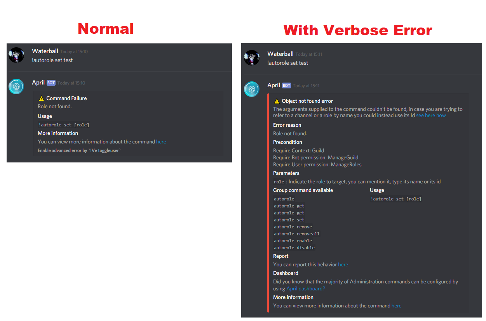

Are you having a hard time figuring out how to setup a service or just correctly use a
command? Then you should definitely enable Verbose Errors that is made to help you using
command by giving you all you need to successfully execute that command. For example,
it will provide all precondition, parameters and description, if available related command
group and the usage of the command. In additional to Verbose Error you can visit
[April Website](https://aprilbot.me) and in the [command](https://aprilbot.me) tab you can
find also videos examples. Below a preview image.

{.center}

If you reached till here probably mean you are excited to enable Verbose Error, fine then
here how to enable this service:

1. Decide whether you want to user Verbose Error only for user or for the entire server,
if you choose to enable only for user then the service will only apply to you in any
server you are using april, if you choose to enable for the server then all user in the
server that fails to use a command they will automatically get an advanced error.

2. Let's enable the service, to enable the service only for you then just type
`!Ve toggleuser`, else if you want to enable for all user in your server then type
`!Ve toggleserver`.

{.center}

Finally, if you want to test if is working you only have to make a command fail,
 you can try by typing `!cat ugly` or any other command.