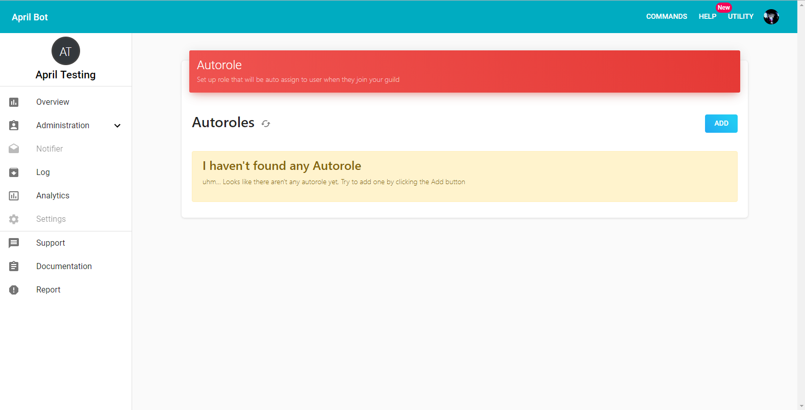
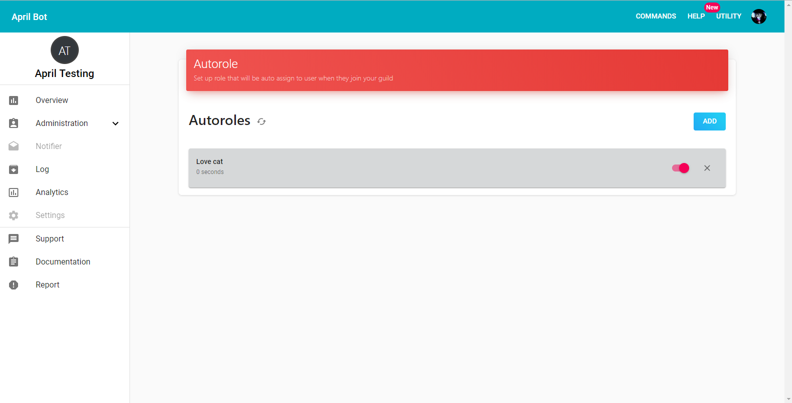
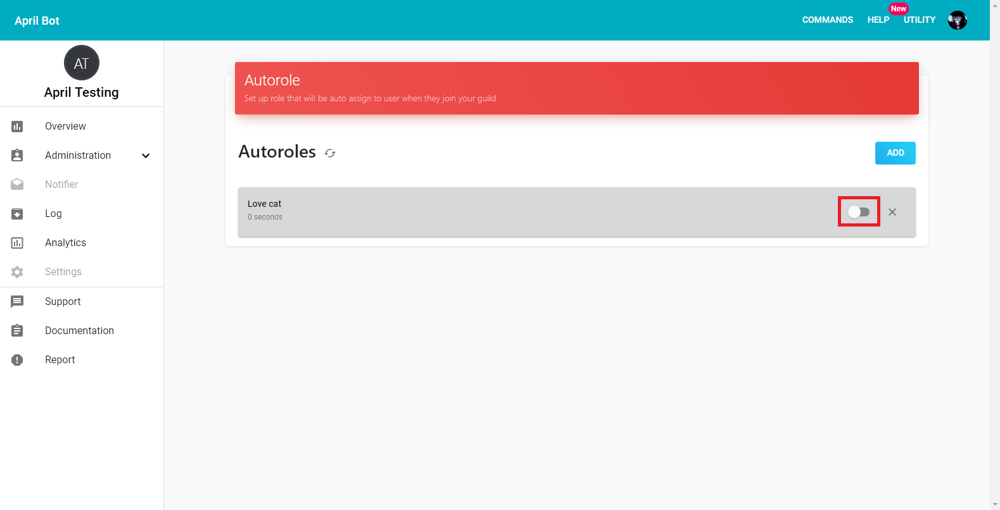
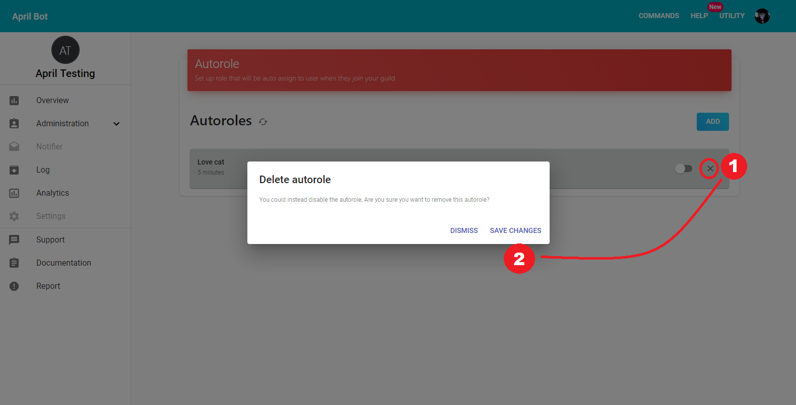

In this guide we walk-through how-to setup the autorole service by using the April
dashboard. below an example of how the setting screen looks like.

{.center}

<h6 class="text-muted mb-3">Below are the steeps to setup autorole using dashboard:</h6>

1\. Go into autorole service screen in the dashboard, then in case you still
don't have any autorole click on Add button on the right, a modal will pop up and
you'll be asked to select a role, after that click on SAVE CHANGES button.

{.center}

In case the role that you're trying to target is higher than April role then
a message will pop up and April will refuse to add that role as Autorole, in this
case check out your <a target="_blank" href="https://support.discordapp.com/hc/en-us/articles/214836687-Role-Management-101">Hierarchy</a> and
place April role higher than the role that you're trying to add by going on
Server Setting and on Role tab drag and drop April Role at the top of the role
you're trying to add.

{.center}

Below an example of how it should like, note that April role is at the top so it
can add any role, but if you prefer you can placing only at the top of the role
that you're trying to add to autorole.

{.center}

After changing your Hierarchy reload the page and try to add it again and if all
went right you should be able to see a screen like below.

{.center}

2\. By default the added autorole get enabled itself, but you can temporally disabled and
re-enable at any time by using the switch of the autorole.

{.center}

3\. Finally, to remove an Autorole use the X icon on the right of your target autorole
after that a modal will pop up that will ask you if you are sure you want to delete
that autorole, if yes then press SAVE CHANGES button.

{.center}

