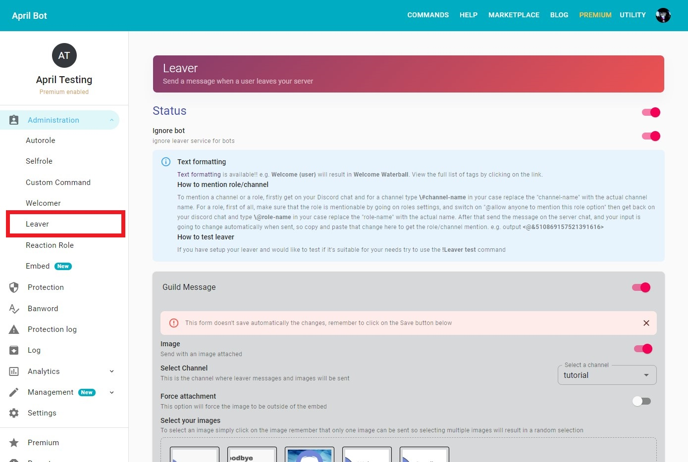
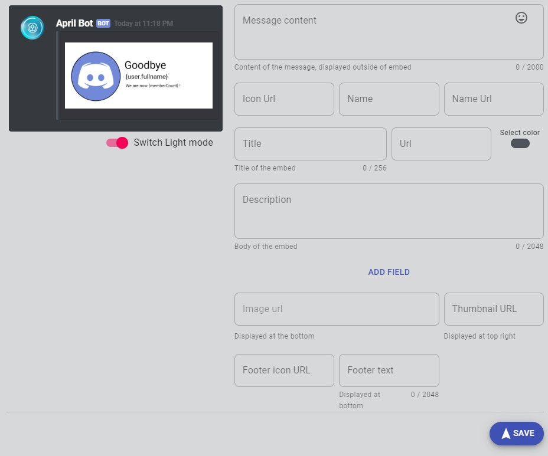
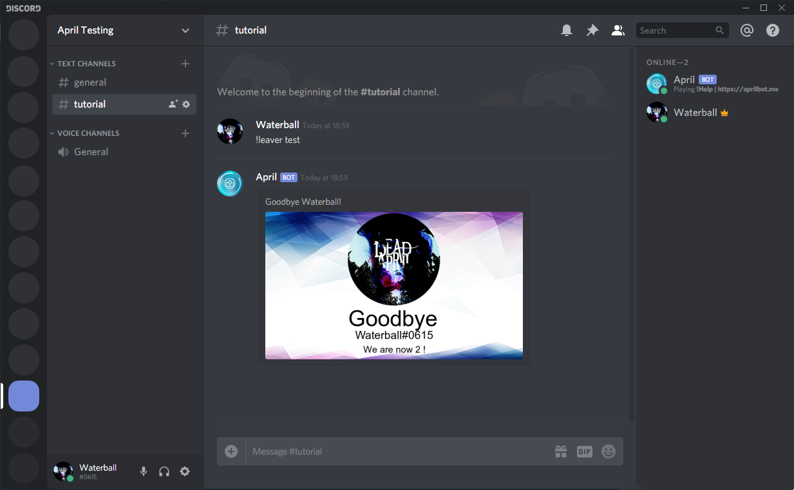

Leaver, as the counterpart of welcomer,
 has a variety of service that allow you to say goodbye to your users,
  In this guide we walk-through how-to setup the leaver service by using the April
  dashboard. below an example of how the setting screen looks like.

{.center}

## Get to leaver setup page
First of all you need to be logged, follow [this guide](../login.md) to login
on the dashboard, and [select your target guild](../select-guild.md)
then you should be able to see the sidebar with your server name, on the sidebar click on
administration button that should expand below with more options,
therefore click on Leaver option and
you can now edit your leaver settings!

* On desktop

{.center}

* On mobile, you can view the sidebar by swiping from the left side to the centre or by 
clicking on the hamburger menu icon on the top navigation bar available when you have
selected a server

{.center}

## Enable or disable leaver service
Enabling leaver service is really easy, first of all get on the leaver setting page as
showed previously and simply turn on the switch next to the Status text and the leaver service 
will be operative or disabled based on whether is checked or not
for your server. Remember that additional configuration are required for the leaver to work.

{.center}

## Enable and configure leaver images
First of all make sure you have the guild message enabled and set a channel 
and the image switch is on. You can set
a channel by just going on the select a channel section and selecting the wanted channel,
also if you haven't choose a channel yet, the section will have red borders. Make
sure your image switch is on by going on the image section and turn on the switch. If you
have turned on the Image option you'll see below the **Select your images** section and in here
you can choose your images, if you cannot see any images then click on the create new image
button and create one to be able to choose one for your leaver.

{.center}

If you don't have create an image yet you can click on the **CREATE NEW IMAGE** button that
will take you to your images and where you can create one by using a plain design or using
a template. In addition you can purchase image from the marketplace so you don't have to worry
about creating one. After you have create your image or if you already had one you can simply tap
or click on the image to select it, selecting one or multiple images will have different effects:

* If you select one image then that image will always be attached to the message if settings permit it

* If you have selected multiple images then one random image will be sent between the selected images

More info about creating an [image here](../editor/create-an-image.md)

## Configure a leaver message
Would you like to attach a message to the message? below the image selection you can easily
setup your message by editing the fields, you can also preview how your message is going to look
like. you read more about embed messages [here](../create-embed-message.md){:target="_blank"rel="noopener"}

!!! info
    Remember to click on the save button once you are happy with your settings, if the button is 
        disabled or grey then it just means that it's all already saved

- __**Text formatting is available to use**__, 
[view all the tags available to use](../formatting.md)
e.g. {user} will result in `Waterball` or in your case the user who just left.

{.center}

## Ignore bot
The ignore bot and embed features are enabled by default, but you can disable them by just
turning off the switch.

- __**Ignore Bot**__: It will ignore the leaver announcements for bots

## Test
April allows you to test your leaver service, you can either preview your image on the
dashboard by going on the leaver setting page and click on preview or directly emulate
a user left on discord chat by typing 

```markdown
!Leaver test
```

{.center}
