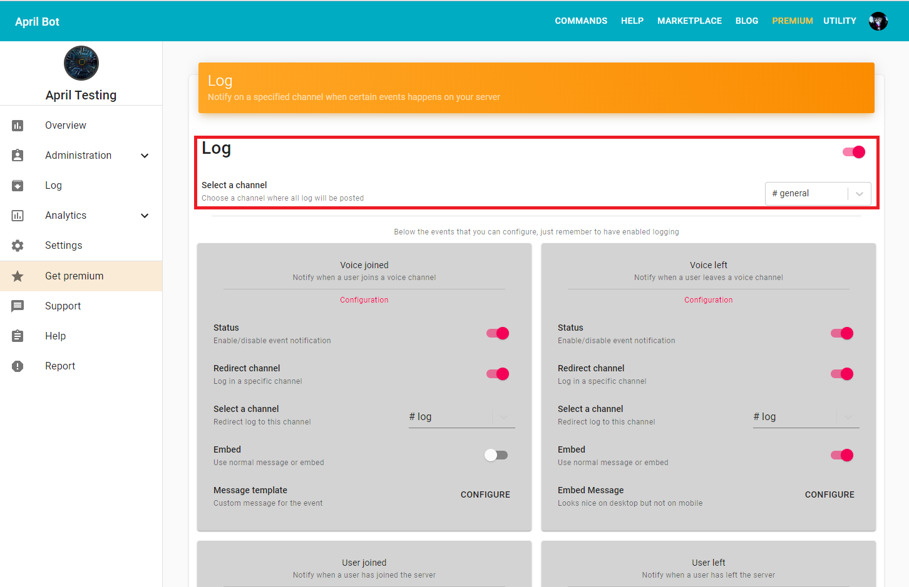
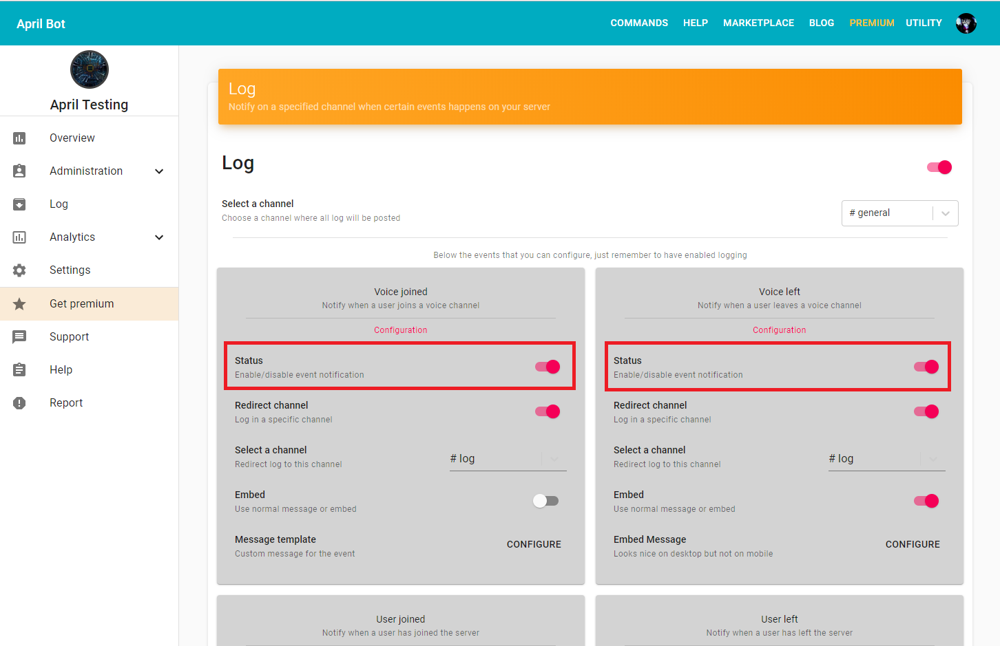
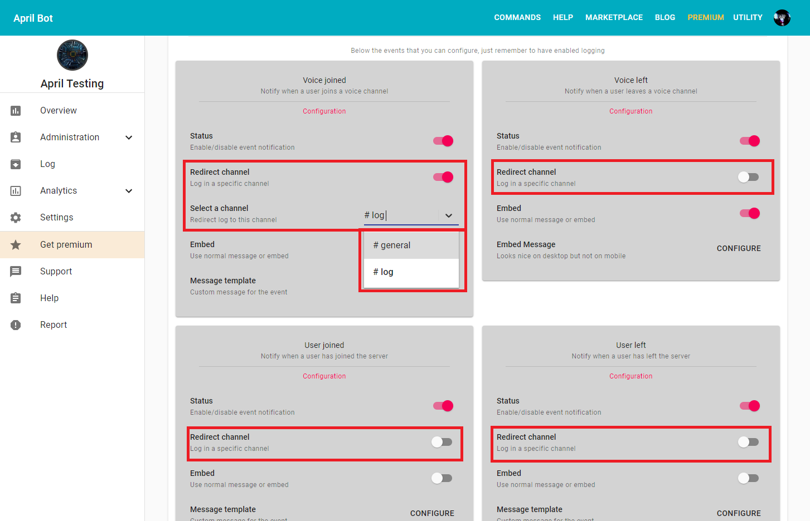
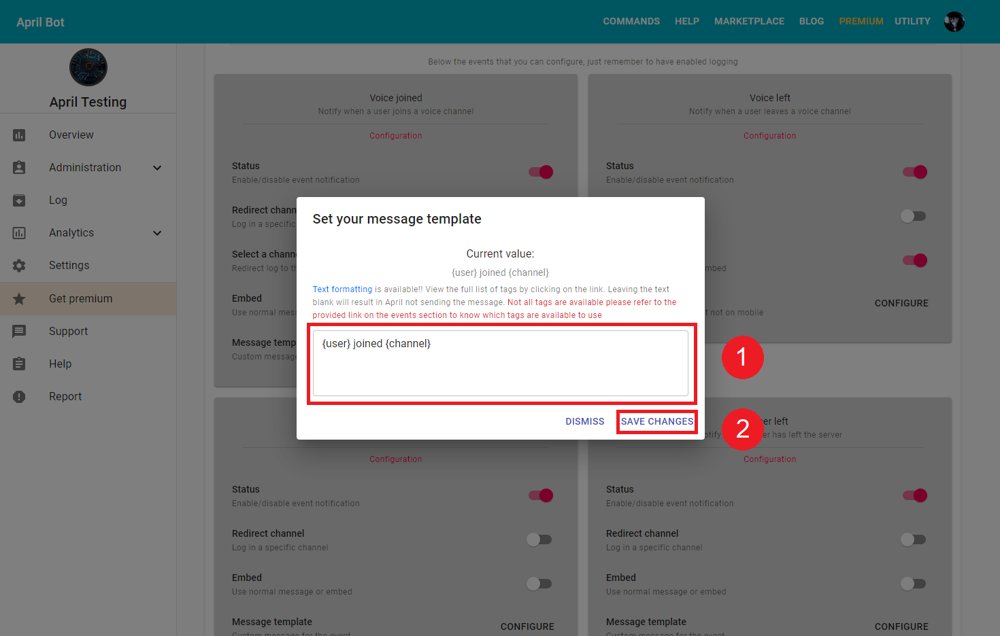

Ready to enable logs in your server and get powerful data to monitor your users? Logs
allow you and users who can access log channel to know what happened while you were
absent from Discord. Below an example of logging channel.

## Get to log setup page
Let's get started by locating the log setup page, first of all follow
 [this guide](../login.md){:target="_blank"rel="noopener"} to login
on the dashboard, and [select your target guild](../select-guild.md){:target="_blank"rel="noopener"}
then you should be able to see the sidebar with your server name, on the sidebar click on 
log button and now you should be able to see the log setup page.

## Enable/disable logging
Enabling log service is really easy, first of all get on the welcome setting page as
showed previously and simply turn on the switcher and the log service will be operative
for your server. Finally, below you should see the Select a channel section, make sure
a channel is selected in order for the service work.

## Enable/disable single event notification
With the new update you are now able to enable or disable single event to notify, by default
all events are enabled. First of all, get on the log setup page, refer to 
[Get to log setup page](#get-to-log-setup-page) on how to get on that page, afterward
below Select a channel section you should see a lot of light grey panels with the title
of each events. To enable/disable a single event all you need to do is just switch on/off the
switcher on Status section, and you will not get notified any more about that event.

## Notify event to a different channel
Tired of having to scroll up all the way up to find if user left you guild? Here redirect
channel to log events in a specif channel, so your log channel doesn't become a mess.
First of all, get on the log setup page, refer to 
[Get to log setup page](#get-to-log-setup-page) on how to get on that page, afterward
below Select a channel section you should see a lot of light grey panels with the title
of each events. To enable/disable the redirect channel simply turn on/off the switcher
of Redirect channel section, therefore you should see a that below new option pop-up, called
Select a channel, there you can select the channel where you would like April to send the
message. 

## Edit default plain message
By default every event has a default template but you can edit with any text you want and
text formatting is available to use!
First of all, get on the log setup page, refer to 
[Get to log setup page](#get-to-log-setup-page) on how to get on that page, afterward
below Select a channel section you should see a lot of light grey panels with the title
of each events. Select one of your choice event and click on Configure on Message template
section. Make sure that the Embed switch is off, in order to view the option.
 Afterward, a dialog should pop-up with the current value of the message, to edit
the message simply change the content of the text field. You can also use text formatting
just remember that not all tags are available, refer to 
[this link](../formatting.md){:target="_blank"rel="noopener"} to know which tags are available to use.

## Enable and edit embed message
Tired of plain messages and looking for something more fancy? Here embed messages ready
to serve your server!
First of all, get on the log setup page, refer to 
[Get to log setup page](#get-to-log-setup-page) on how to get on that page, afterward
below Select a channel section you should see a lot of light grey panels with the title
of each events. Select one of your choice event and turn on the switch in Embed section,
therefore you should see a that below new option pop-up, called
Embed Message, now click on Configure and a dialog should pop-up. You can now configure
your embed message. Below are the options available at the moment.

- __**Color**__: this indicate the color of the embed
- __**Author**__: the text to display on the author field. 
- __**Title**__: the text to display on the title field.
- __**Description**__: the text to display on the description field.
- __**Footer**__: the text to display on the footer field.
- __**Current Timestamp**__: whether display the timestamp on the footer. 

More about embed [here](../create-embed-message.md){:target="_blank"rel="noopener"}

## Should I use embed message?
This depend on the the size of you server, if your server receive a lot of events then
we suggest you to use plain messages else if it receive only few events then use embed
messages. Embed messages are heavy and can affect the loading of the channel. Finally,
embed messages looks good on desktop, but not on mobile.

