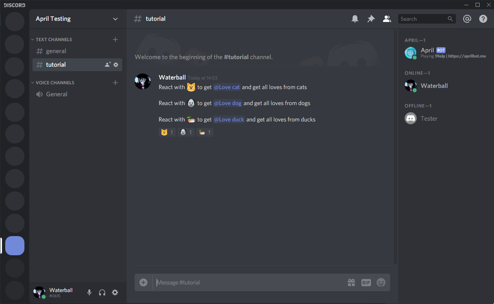
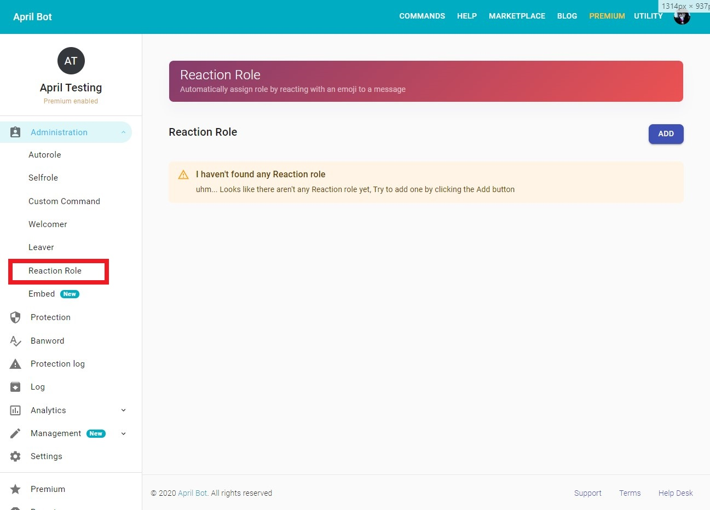
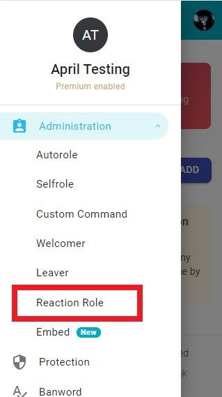
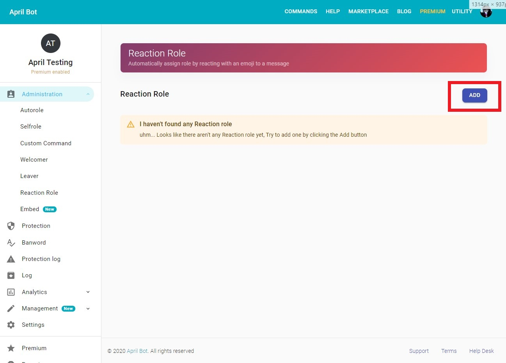
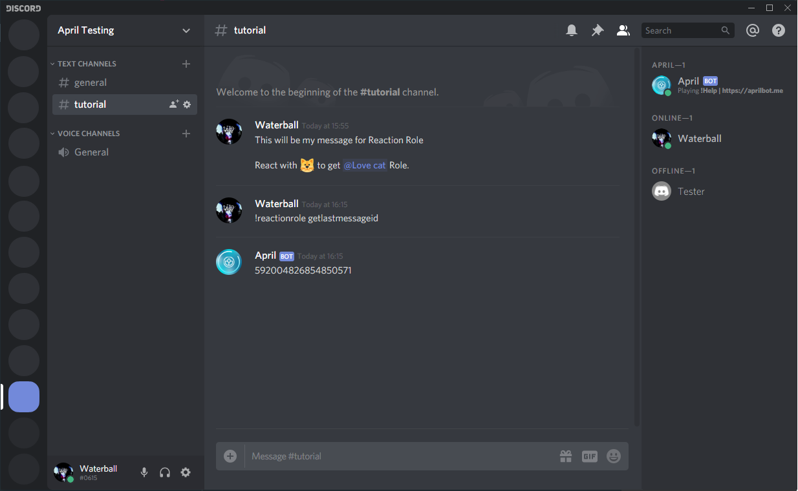
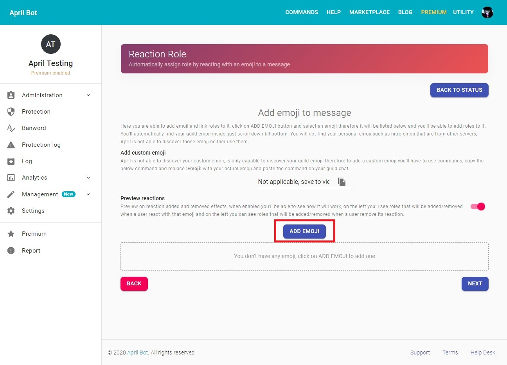
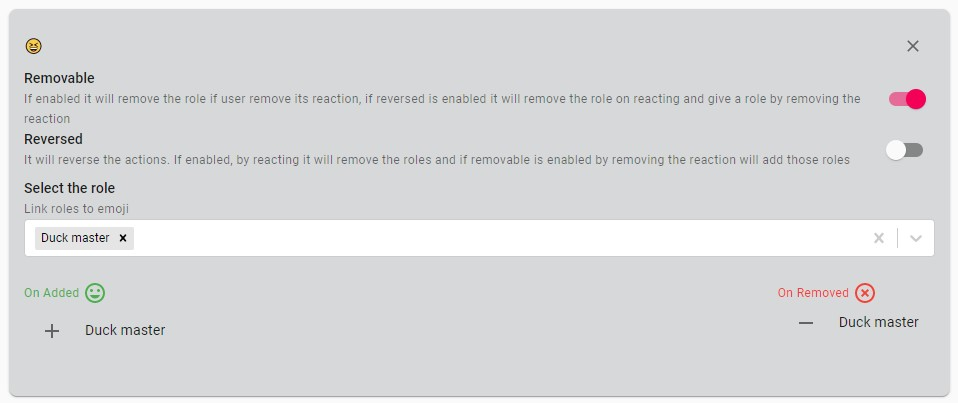
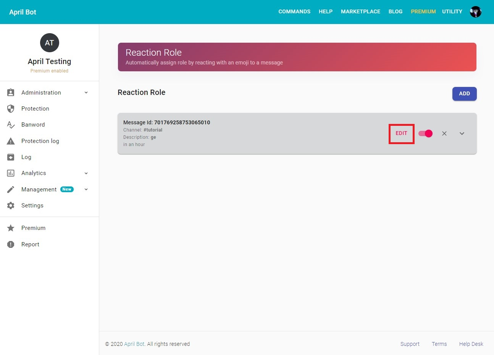

In this guide we walk-through how-to setup the reaction role service by using the April
dashboard. below an example of how reaction role can look like


{.center}

## Get to reaction role setup page
First of all you need to be logged, follow [this guide](../login.md) to login
on the dashboard, and [select your target guild](../select-guild.md)
then you should be able to see the sidebar with your server name, on the sidebar click on
administration button that should expand below with more options,
therefore click on Reaction role option and create new reaction roles or edit the current one

* On desktop

{.center}

* On mobile, you can view the sidebar by swiping from the left side to the centre or by 
clicking on the hamburger menu icon on the top navigation bar available when you have
selected a server

{.center}

## Create a new reaction role
First of all get on the reaction role setup page, therefore click on the __**ADD**__ button next to the
Reaction Role text

{.center}

Once you've clicked the __**ADD**__ you'll be then taken to a wizard where you can choose whether 
create a new plain reaction role with a new message or use an already existing message.

* If you choose a new message you'll be taken to a embed setup page where you can choose how your
new message is going to look like and choose the channel where you want to send it, you can read
more about embed [here](../create-embed-message.md){:target="_blank"rel="noopener"}

* If you choose to use an already existing message then you'll be asked to provide a channel
and a message id, you can get your message id by enabling the developer mode and clicking on your
message and copying it's id or you can simply use April built-in `!reactionrole getlastmessageid`

```markdown
!reactionrole getlastmessageid
```

{.center}

The next step is to add reaction and link them with roles, at this point you cannot add your
custom emojis but you'll be able to do it afterward. So, to add an emoji simply click on the 
**ADD EMOJI** button, therefore an emoji picker will pop-up and you'll be able to choose an emoji.

{.center}

After you've picked an emoji you'll see that a new panel has been added below with your emoji as 
a title. In this panel you can manage your emoji and select how is going to behave, the following
options are available:

* __**Removable**__: If enabled it will remove the role if user remove its reaction,
 if reversed is enabled it will remove the role on reacting and give a role by removing the reaction
* __**Reversed**__: It will reverse the actions. If enabled, by reacting it will remove the roles and if
 removable is enabled by removing the reaction will add those roles
* __**Select role**__: here you're able to select the role that will be attached to the reaction

If you don't understand those options you can simply enable the **Preview reactions** option above the
**ADD** button that will give you a preview on what's going to happen if a user reaction with that
emoji or remove it's reaction.

{.center}

Once you have selected all your emoji and selected the appropriate roles click on the next button,
in the next setup page you'll be able to finalize your settings by adding a maximum amount of 
role that April can give and set how many roles a user can pick, in addition you are able to set
timed reaction role that after the date and time specified they will automatically disable. Finally,
you're able to add a description, allowed role, ignored role.

Once you've setup the reaction role with your settings simply click on the **CREATE REACTION ROLE**
 button. 
 
 {.center}
 
## How to add custom emoji

You cannot add custom emoji on the dashboard you'll have to complete this process with commands. 
Once you've create a reaction role simply click on the EDIT button, therefore on the *Add custom emoji**
section simply copy the text and paste on your Discord channel and replace the `:Emoji:` text with
your actual emoji. 
E.g.
```markdown
!reactionrole add 2629 :Emoji:
```

## How to edit

!!! danger
    Remember that removing reactions on the dashboard
     will not remove them on the message itself, you'll
    have to remove them manually

To edit a reaction role simply click on the **EDIT** button, and you'll be taken to a wizard and
you'll be able to add or remove emojis and change the settings. Remember that at this point
you cannot edit your message anymore.
    
{.center}
    

    
    
    