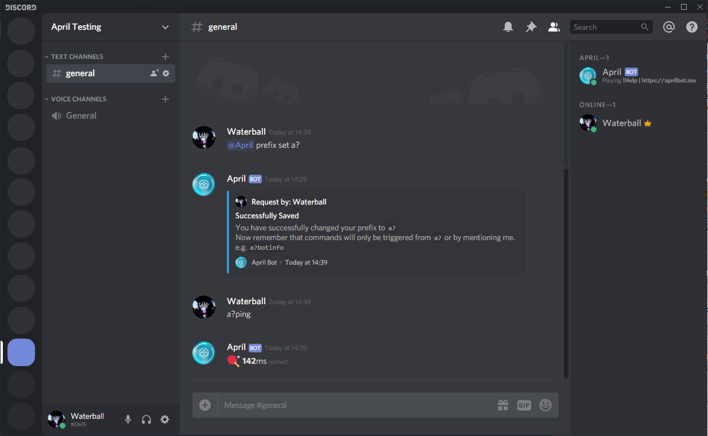

Have you got others bot that have the same prefix as April? Then you should change April prefix into something else, or have you just forgotten what
was April prefix and now you are desperate because you cannot use its feature? Then you
are in the right place because this guide will walk through how to change and
view your current prefix easily. By default, April prefix is "**!**"
or you can mention April and write the command

## Get current prefix
To get your current prefix all you need to do is mention April by typing
``` markdown
@April#4100 prefix status
```


## Change Prefix
To change the prefix of April all you need to do is type
`@April#4100 prefix set [New Prefix]` e.g. `@April#4100 prefix set a?` and in case all
went well April will reply with a successful message, in case of failure make sure your
new prefix is not than 3 characters. You can now test your new prefix by just typing it
and followed by a ping command e.g. `a?Ping`

* Examples:

```markdown
@April#4100 prefix set a?
```
```markdown
@April#4100 prefix set !
```
```markdown
@April#4100 prefix set [
```




