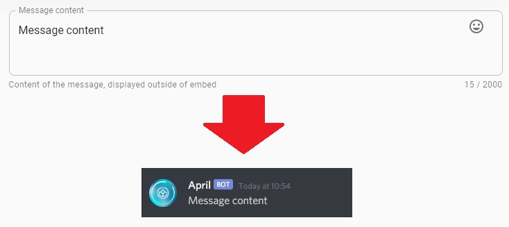

Embed messages are enriched messages with additional feature than normal messages such as adding image
and using embed. With embed message you are able to create powerful message that contains a lot of 
information and that looks really cool. So, let's begin by explaining each field that you can
use on the embed message. Normally next to your embed message you'll be able to preview how
your message is going to look like.

* __**Message content**__: this is the message displayed outside of the embed, it can contain up
to 2000 characters.

* __**Icon Url, Name and Name Url**__ are part of the embed author message, they are displayed at 
the top of the embed

!!! danger
    Note that **Icon Url** will only work if **Name** field is present otherwise it will just throw an 
    error

* __**Title, Url and Colour**__ are part of the embed title, they are displayed at the top of the
embed unless the author of the embed is specified in that case they will it will be placed below of
the author. 

* __**Description**__: is displayed inside of the embed in the body section

* __**Fields**__: are name value fields and you can have up to 25 fields

* __**Image url, thumbnail url**__: images displayed inside the embed

* __**Footer icon URL and footer text**__: are displayed at the bottom of the embed

Here the final result if you combine all of them

