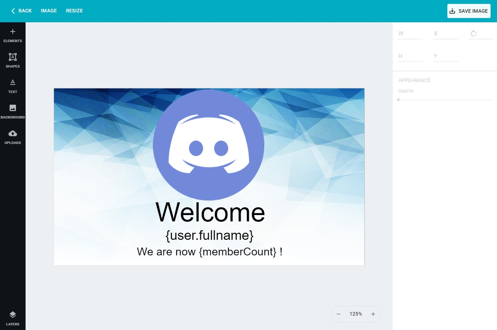
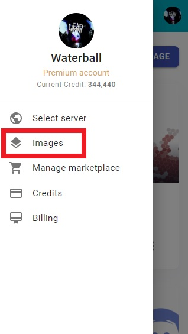
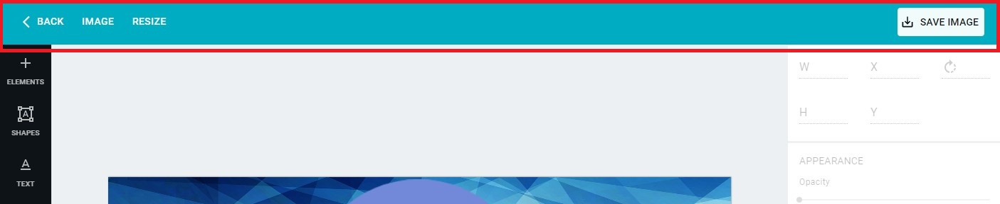
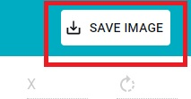
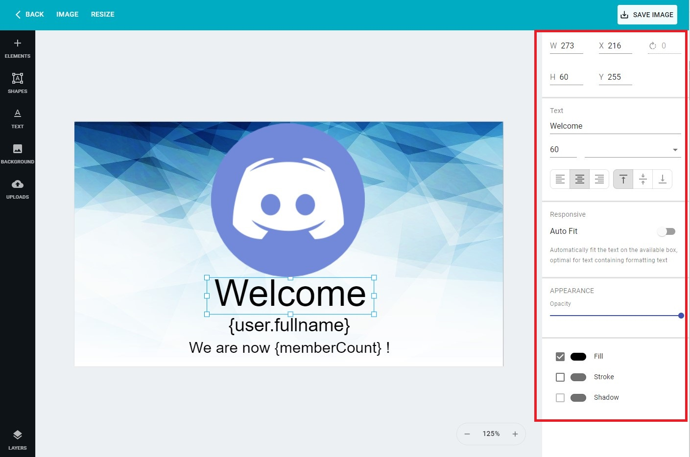
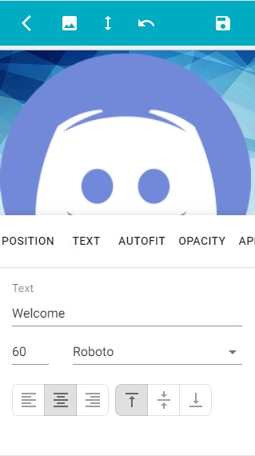

# Editor

In this guide we walk-through how-to create an image by using the April editor. below an example of 
an image made with the editor.

## How to get to the editor
First of all you need to be logged, follow [this guide](../login.md) to login
on the dashboard,
then you should be able to see the sidebar with your name, on the sidebar click on
images button therefore you should be redirected to the images selection in here you can
see all your images and eventually edit them on the editor

=== "Desktop"
    
    
=== "Mobile"
    {.center}

## How to create a new image
To open the editor you'll be required to have an image and you can create an image by going
[here](https://aprilbot.me/dashboard/user/images){:target="_blank"rel="noopener"} therefore
you'll be able to see your image listed below and click on the **EDIT** button. While creating
your image you'll be able too choose from some templates that will help you starting designing your
image.

After you've clicked the **CREATE NEW IMAGE** you'll be able to create a new image but before 
you'll have to provide some basic information such as **Title**, **Width** and **Height**.
Eventually you can use a template that will choose the Width and Height for you and have
some elements already on the image so you don't have to start from scratch. To select a template
you simply click on the image you want to use and if you want to see how it looks like just click 
on the eye icon on top-right corner of the image that appear when hovered.

## Tools
Let's begin with the available tools on the editor, the first section in the editor is the top
navigation bar, in here you can save your image and any changes made, change the image name, 
resize the image or get back to your previously page.

Below are listed the tools that you can use on the top navigation bar, the navigation is almost the
same on desktop and mobile, the only difference is that on mobile the text gets replaced by icon
but they always have the same position

=== "Image"
    By clicking on the image button on the top navigation or on an image icon on mobile you'll
    see a panel popup in here you can change the title of the image
    {.center}
    
=== "Resize"
    By clicking on the resize button on the top navigation or on the resize icon on mobile you'll
    see a panel popup in here you can change the size of the image
    {.center}
    
=== "Save image"
    By clicking on the save image button you'll simply save all the changes made to the image,
    remember that is important that you save each time you make changes to an image or once you've
    finished editing your image
    {.center}
    
The next tools available are the one on the left sidebar, those directly add elements or remove 
them from the canvas. Below are listed all the tabs available on the sidebar:

* **Elements** or :material-plus: this tab contains dynamic made elements such as Discord avatar
that will be replaced when the actual image is produced

* **SHAPES**: this tab contains shapes, at the moment there aren't many shapes available but there
will be more shapes available soon.

* **TEXT**: this tab contains text elements that you can add on the
canvas 

* **BACKGROUND**: this tab contains some default background that you can use in your image

* **UPLOADS**: this tab contains all your image that you've uploaded on the platform

* **LAYERS**: this tab contains the elements on the canvas

The next tool available on the editor is the configuration bar located on the right side or at the
bottom on mobile devices that only appears once an element get selected. By default the configuration
section will appear disabled but if you click on an element you'll be able to see what you can
edit about the element by simply selecting it.

=== "Desktop"
    {.center}
    
=== "Mobile"
    {.center}
    
Each element on the canvas has different properties that can be changed you can click on an 
element and you'll see on the configuration bar the available parameter that you can change. All
elements has in common some basic element such as position and opacity. 

To learn more about the editor please follow the others specific post.