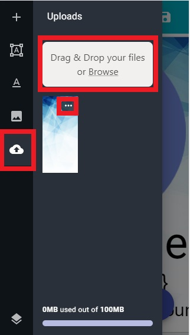
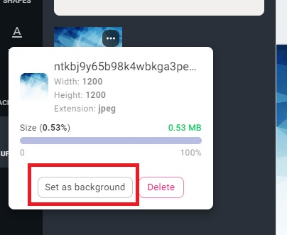
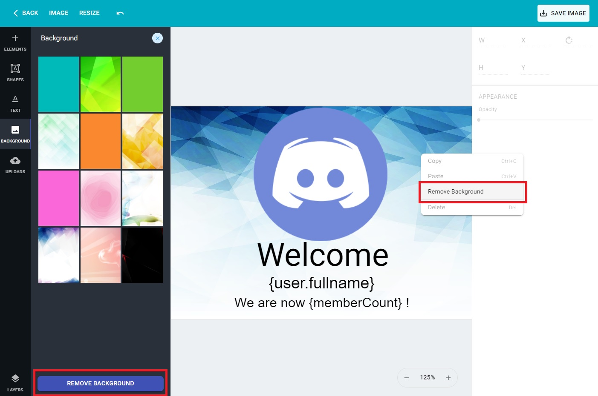
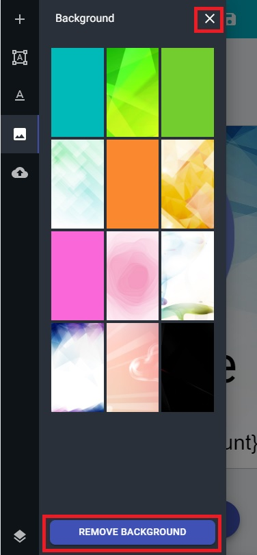

By default the editor has some background that you can easily use by just clicking on the Background
icon on the left sidebar or on the Plus icon on mobile device. Afterward you simply click on the
background and it will instantly change the canvas background. But if you want to use a custom
background you'll have to download your background image and upload it on April servers. 

## How to change background

The first step is to click on the Uploads icon on the left sidebar or on the Plus icon on mobile
device and the on the Upload icon. Afterward click on the **Drag & Drop your files or Browser**
section at the top to select your image and upload it. After you have successfully upload you'll
be able to see the image on the list below. At this point you can simply click on the more icon
on the top-right corner and a panel will pop-up, in this panel just click on the Set as background
and your background will change to that image.

=== "Desktop"
    {.center}
    
=== "Mobile"
    {.center}
    
    
    {.center}
    

{.center}

## How to remove a background

=== "Desktop"
    On desktop is fairly easy just click on the Background button on the left sidebar and at 
    the bottom click on the **REMOVE BACKGROUND** button. On desktop you also can remove the
    background by right clicking on the canvas and clicking on **Remove background** option.
    
    {.center}
    
=== "Mobile"
    On mobile click on the fixed bottom-left plus button and click on the background picture image
    tab, therefore simply click on the **REMOVE BACKGROUND** button or the top cancel button that
    will remove the background as well.
    
    {.center}