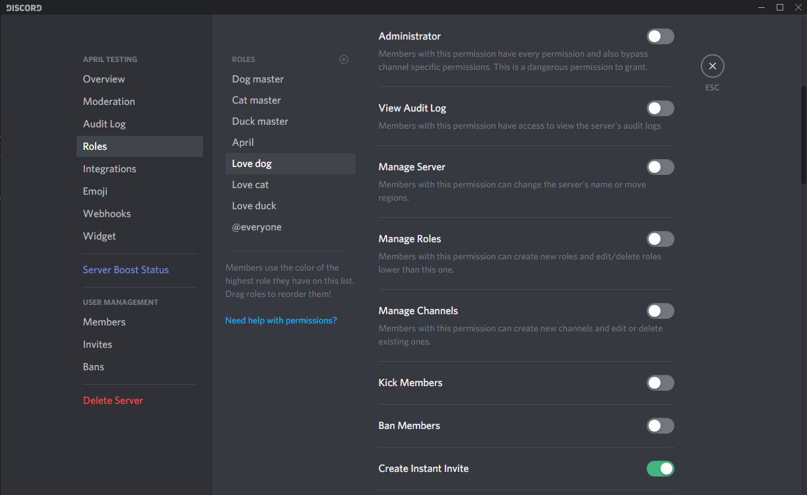
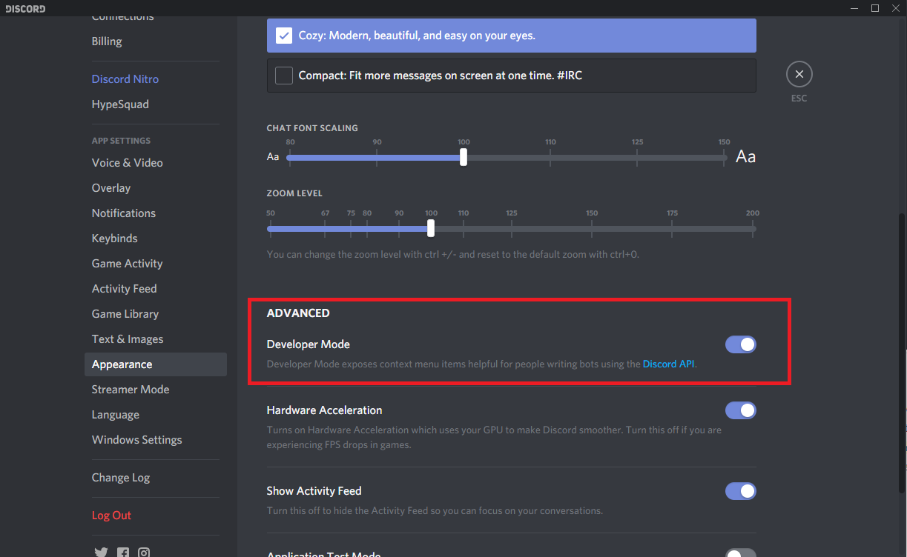

Are you having a hard time with April and keep getting only errors and errors? then
follow this article that explains most of the errors. Below are listed the most common
error that you can encounter while using April.

## The input text has too few/many parameters
This is probably the 80% of command April command failure 😢, so let's start with why does
this error appear? The reason is because you have supplied too many parameters or
 too few parameters as the error itself says, let's make an example with the command
`!Clear` if you try to run `!Clear 5` it most likely going to fail because there's not such
a command that matches, yes `!Clear` is a command but adding that 5 mislead
the command mapping. Running `!Clear messages 5` it apparently looks like a valid command
but adding that `messages` mislead the command mapping and results in a command error
the right command is `!Clear message 5`.
__**So most of the time those errors are caused for wrong spelling.**__ The error can also be
caused because you're trying to execute a command that does not exist but has a fallback
such as group commands. e.g. `!Welcome set my welcome message` this command will always fail
there isn't a command that matches `set`, so the command mapping will guess that you're
referring to `!Welcome` command that does not accept parameters. The best way to prevent those
errors are to looking at the
<a target="_blank" rel="noopener" href="https://aprilbot.me/commands">
command documentation
</a>

## User requires guild permission
The command failure of this error are approximately 1%, so why does this error appear? Its most
likely that you're trying to execute a command that you do not have permission to use, you
should ask to the owner of the server or user with Administrator permission to assign the
required permission to execute that command. Where do they assign those permission? Get on
your Server Setting -> Roles and there you can assign permissions to roles and therefore add
those roles to users and get your permissions. Do you think you got those permission but
keep getting this error? Then kick April and invite it again, the cause can also be server
errors.

## Bot requires guild permission
Why does this error appear? As the error say itself, April is missing the required permissions
to execute the command. So how to fix it? get on your Server Setting -> Roles and there
locate the April role or any role that you assigned to April and make sure that its has
the required permission. If you invited April by using the provided link and did not touch
any permission then you're more likely having already all permission, but if you are anyway
getting this error then should probably kick April and invite it again, the cause can be a
server error.

## User/Role/Channel not found
Why does this error appear? As the error say itself the user, role or channel could not be
found by April, it can be a misspelled word, try always to match the whole word using also
capital letter is necessary. The error still appear? remember that you can always refer to
a user/role/channel by using its mention, for mentioning a user and role start typing `@`
and they will automatically appear in the chat hints, for the role you wanna make sure
that is mentionable by going on Server Setting -> Roles -> (Target role) -> Switch on
`Allow anyone to @mention this role`. For mentioning a channel start typing `#` and it will
automatically suggest you the channels. Still getting this annoying error? Then get the id
of the user/role/channel by going on User Settings -> Appearance -> Advanced section ->
Switch on Developer Mode. Now you can right click the user/role/channel and click on Copy ID
therefore use that id in the command.

## Nothing works
If all the above solution did not fix the problem then or April is just not responding then
make sure that April has the permission the view or even send the messages. Also it could be
that your prefix is not `!` and April is literally ignoring all your attempt to execute
a command, check your prefix by typing `@April#4100 prefix status`.
If that did not work out then try to kick April and invite it again. Again if even that
did not work out then try join the [support server](https://discord.gg/UKPKS4T)
