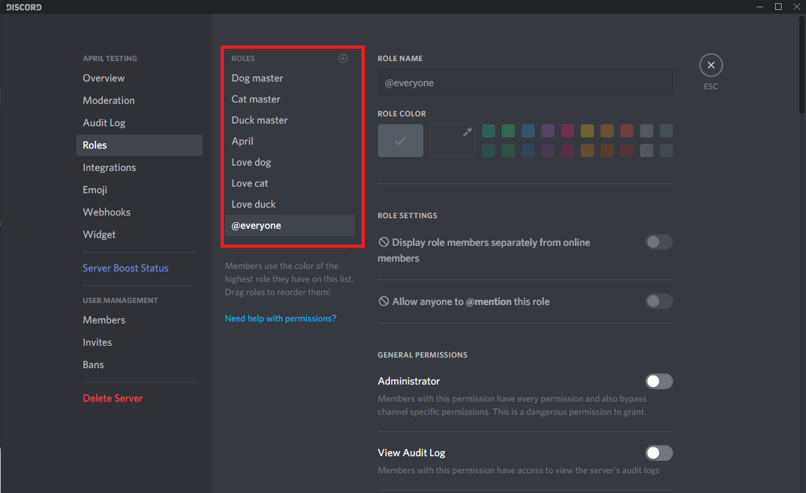
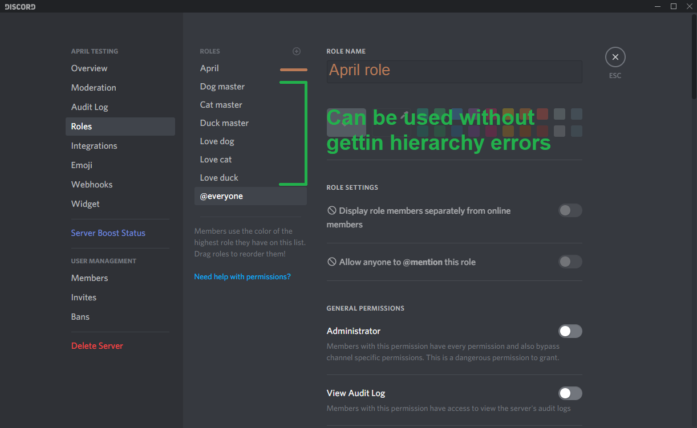

Discord role hierarchy is probably the most confusing thing for users so let's
 begin with saying what is hierarchy? Discord hierarchy is how your roles are arranged, the
 higher role has more power than the lower,
 hierarchy is needed
for April to assign roles for services like __**Autorole, Reaction Role**__ or
__**Selfrole**__,
April cannot assign a role that is higher than its roles and giving an __**Administrator**__
role won't solve the problem. So how to fix it? The solution is simple just arrange the
roles in a way that April role is always at the top of the role that you're trying to setup.
So where is this Discord hierarchy? You can find it by going Server Settings -> Roles.

How do I arrange those roles? Its simple just drag and drop them, If you are the owner of
the server then you can arrange the roles as you want, if you are a member then you more likely
required to have __**Manage roles**__ permission, in addition you cannot move role with higher
hierarchy or move your role at the top.

As you can see from the image above, the roles: __**Love dog**__, __**Love cat**__ and
__**Love duck**__ can be assigned to user by April, but __**Dog master**__, __**Cat master**__
 and __**Duck master**__ cannot be assign to user by April. To assign those roles you
 should set the April role at the top of them. Like so:

 Now any role in the guild can be assign to users by April if its setup, remember that you
 if you're planning to only setup 1 role then April role doesn't have to be at the very top
 but only higher than the role you're trying to setup.
