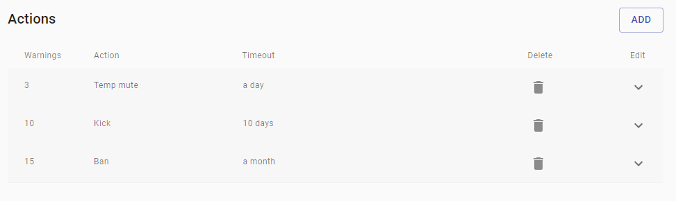

Automated action is a system that automatically performs specified action when the set warning
threshold gets hit by users

## Warnings

Indicate the threshold of warnings that triggers the automated action, make sure to not stack
warnings, as only one automated action can be executed per time. For instance, if you
have set up 2 automated actions with the same set of warnings and same timeout you can expect
 to see that only one automated action will be executed. You can have multiple automated actions with same set of warnings but always
make sure that the timeout is different from each other.

## Available actions

   
### Mute
Users will be unable to send messages on text channels. Mute the user only
if a muted role is selected on the settings, otherwise, no action is taken.
 Moreover, if the user tries to leave and rejoin he will automatically get the muted role.

### Ban
Ban the user from the guild

### Soft ban
Ban the user from the guild and prune messages old 7 days.

### Temp mute
Mute the users for a determinate time

### Temp ban
Ban a user for a determinate time

### Kick
Kick the user from the guild

## Timeout

   
This indicate the amount of time that warnings should be counted in, for instance a timeout
of 1 day will count all the warnings done by the user in one day

## Duration

  
Option available only for Temp mute and Temp ban and indicate the duration of the action,
for instance a duration of 1 day will mean that the user will be muted/banned for one,
afterward he will get unmuted/unbanned
