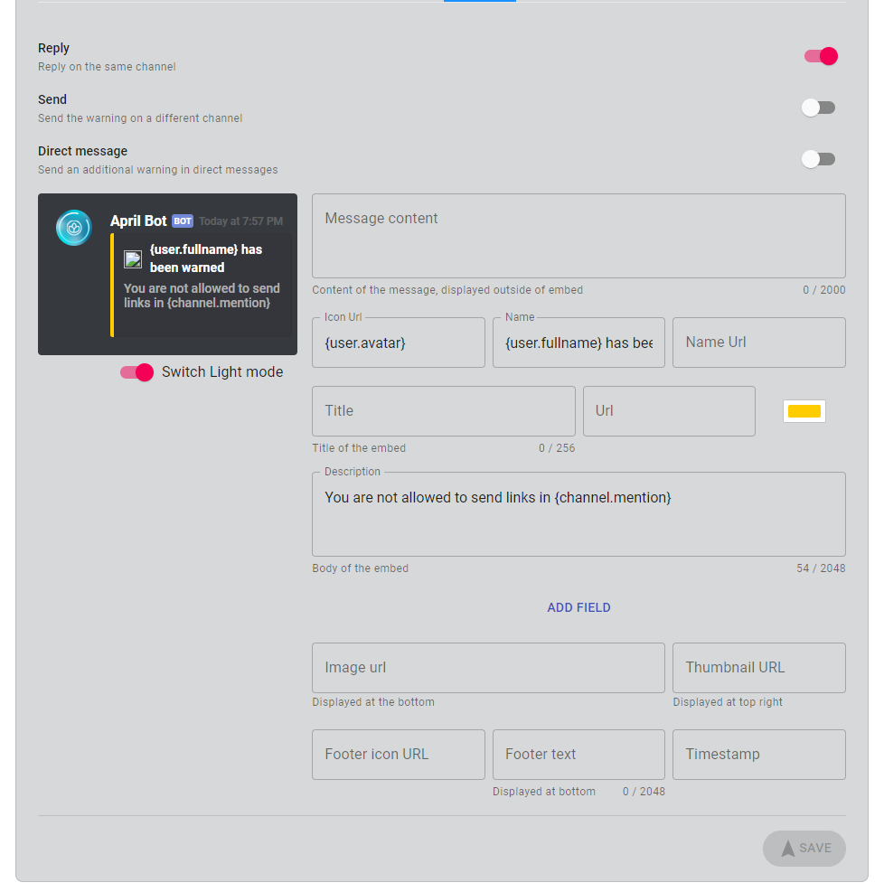
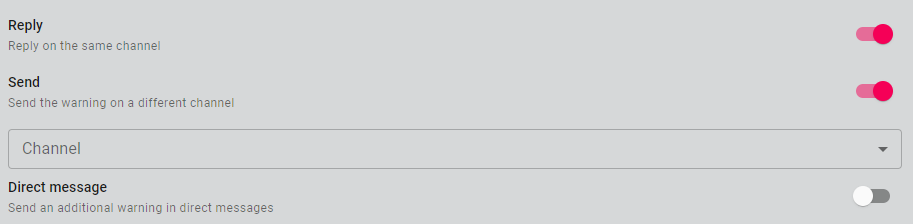
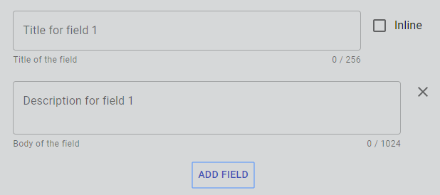

The introduction of the protection system brought a brand-new message customization
 with a preview as well, which includes a reply on the same channel where the warning
  has been made, send to a different channel and send an additional direct message as a
   warning.

## Reply option
When enabled will automatically reply to the user on the same chat

## Send
This option allow you to send the warning message in another channel instead of reply
on the same channel, when enabled it will pop-up a select box below where you can select
your channel.

## Direct message
When enabled it will send an additional message on direct messages

## Text formatting

Text formatting is available to use in every field. For example `{user}` will result in
`Waterball#0615`, [check out the full list](../formatting.md){:target="_blank"rel="noopener"}

## Message content
This is the content of the message that is outside of the embed and can be maximum length
2000, you can use markdown and mention role, channel and users on it just make sure
to use the correct format.

## Embed
All the below content will placed inside the embed

### Icon Url
This is small icon placed at the top left of the embed

### Name
This is text placed next to the icon as text support

### Name Url
If a Url is set when a user click on the name text he'll be redirected to this URL, please
make sure that the URL is valid otherwise it will be skipped.

### Title
This is the title placed below the author field

### Title Url
If a Url is set when a user click on the title text he'll be redirected to this URL, please
make sure that the URL is valid otherwise it will be skipped.
### Colour

The colour on the left of the embed

### Description
The description of the embed, reside inside of the body of the embed and can be max 2048 characters
whitespaces count too.

### Fields
By clicking Add field it will add one field on the embed, you can have a maximum of 24 fields,
each field can have a title, description and you can choose if you want to be inline with
another field that should have the inline option checked as well in order to work. Make
sure to not add many fields because you may encounter in a maximum characters exceed error.

### Image Url
This is the image displayed at the bottom of the embed, make sure it has a valid URL
otherwise it will gets skipped

### Thumbnail URL
This is the image displayed at the top right of the embed, make sure it has a valid URL
otherwise it will gets skipped

### Footer icon URL
This is small icon placed at the bottom left of the embed

### Footer text
This is text placed next to the icon as text support

### Timestamp
This is the timestamp shown at the bottom next to the footer text

### Limits
Always make sure that the embed overall length doesn't exceed 6000 characters, if your
embed exceed then your message will just be ignored.
