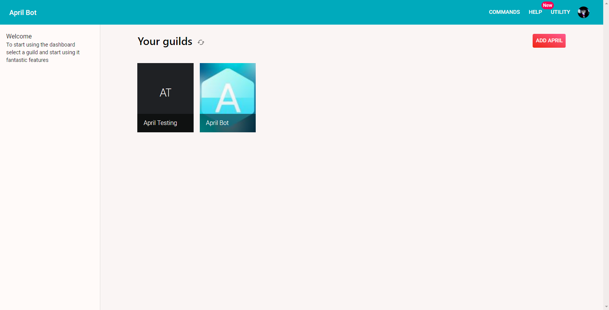
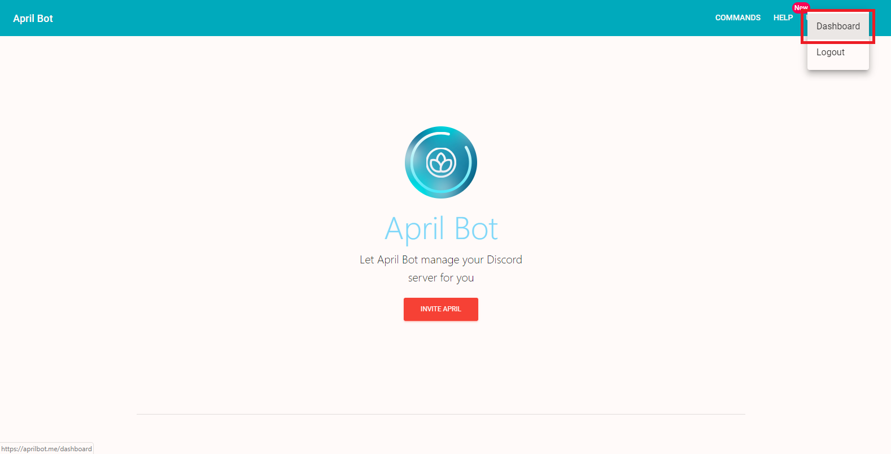
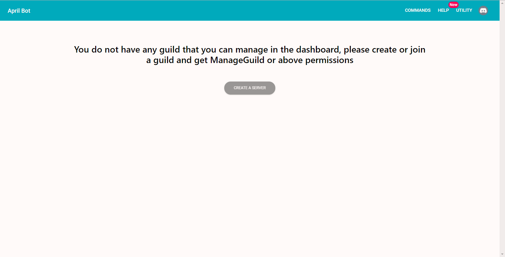

Did you successfully logged into April but now you are getting trouble selecting the
guild? Let's then fix that. Selecting a guild is really easy but you'll be required to
have at least one server with **ManageGuild** or higher permission. Below an example
of how select guild looks like.

{.center}

To get to that screen you have to click on your avatar icon in the top bar navigation
and a dropdown menu will show up, there you can click on Dashboard option and get
on Select Guild screen.

{.center}

In case you do not have any guild with ManageGuild then a different screen will be shown asking you
to get at least 1 server with **ManageGuild permission or higher** and it will
link a link on 
 [how to create a server](https://support.discordapp.com/hc/en-us/articles/204849977-How-do-I-create-a-server-){:target="_blank"rel="noopener"}
Below an example of how the screen looks like.

{.center}

Finally, if you did not have any of those problems then you should be able to simply
click on the target guild and get on the dashboard screen. **If the bot is not on
the target guild then a new tab will be open asking you to invite April in that guild,
after inviting April on your guild refresh the page or use reload guild button**.
Else if April is already in the guild then a dashboard screen should appear.
